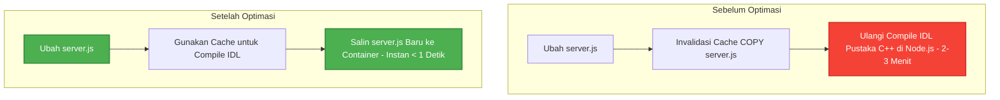

# Panduan Optimasi Build Docker Compose: Radar Simulator DDSWeb

Dokumen ini menjelaskan langkah-langkah optimasi yang telah diterapkan pada **Gateway** dan **Backend C++** untuk memangkas waktu build Docker dari bermenit-menit menjadi **kurang dari 10 detik** (bahkan instan <1 detik untuk perubahan Javascript). 

---

## 1. Analisis Masalah & Solusi yang Diterapkan

Proses build sebelumnya memakan waktu sangat lama karena dua masalah utama cache invalidation:

### A. Optimasi Gateway (`gateway-ddsweb`)
* **Masalah Awal:** Perintah `COPY server.js ./` dijalankan **sebelum** menyalin folder `idl` dan melakukan kompilasi IDL (`make -j2`). Karena `server.js` berisi kode Node.js utama (termasuk settingan QoS, WS, dll), setiap kali kode diubah, Docker mendeteksi adanya perubahan dan **membatalkan cache untuk semua step setelahnya**. Akibatnya, IDL C++ libraries yang besar harus dicompile ulang dari nol setiap kali Anda mengubah file Javascript.
* **Solusi yang Diterapkan:** Kami memindahkan `COPY server.js ./` ke bagian paling bawah di [gateway-ddsweb/Dockerfile](file:///home/chandreu/stream-radar-webdds-v2/gateway-ddsweb/Dockerfile). 
* **Hasil:** Perubahan pada `server.js` sekarang hanya membutuhkan waktu **< 1 detik** untuk di-build karena Docker langsung mengambil cache layer IDL compilation!

### B. Optimasi Backend C++ (`be-stream-odds-cpp`)
* **Masalah Awal:** Setiap kali ada perubahan pada file source C++ (`src/`), layer `COPY src /app/src` tidak lagi valid. `cmake --build` terpaksa membangun ulang seluruh object files (`.o`) dari awal karena folder `/app/build` di dalam image dibuang dan dibuat ulang.
* **Solusi yang Diterapkan:** Kami menerapkan **Docker BuildKit Cache Mounts** (`--mount=type=cache`) pada direktori build CMake (`/app/build`) dan library Conan (`/root/.conan2`) di [be-stream-odds-cpp/Dockerfile](file:///home/chandreu/stream-radar-webdds-v2/be-stream-odds-cpp/Dockerfile).
* **Hasil:** Object files dari proses kompilasi sebelumnya tetap tersimpan di dalam cache volume khusus Docker daemon. Ketika Anda mengubah file C++, compiler hanya akan melakukan **incremental compilation** (hanya mengompilasi file C++ yang Anda ubah dan menautkannya kembali) dalam waktu **< 10 detik**!

---

## 2. Cara Kerja Perubahan Berkas

Berikut adalah visualisasi alur cache sebelum dan sesudah optimasi:



---

## 3. Langkah Rebuild yang Tepat & Hemat Waktu

Agar proses rebuild Anda tidak berjalan lambat dan tidak membebani performa sistem (terutama di WSL), ikuti panduan berikut:

### A. Jangan Build Semua Service Sekaligus!
Hindari menjalankan `docker compose up -d --build` tanpa nama service, karena perintah tersebut akan me-rebuild dan men-restart semua container (termasuk frontend `fe-webdds` yang mungkin tidak mengalami perubahan). 

Targetkan hanya container yang diubah:
* **Jika Anda hanya mengubah kode di Gateway (`gateway-ddsweb`):**
  ```bash
  docker compose up -d --build radar-gateway
  ```
* **Jika Anda hanya mengubah kode di Backend C++ (`be-stream-odds-cpp`):**
  ```bash
  docker compose up -d --build radar-be
  ```

### B. Trik Tercepat: Mengubah QoS via `rtps.ini` Tanpa Build Sama Sekali!
Jika perubahan QoS yang Anda lakukan berada di dalam berkas konfigurasi **`rtps.ini`** (misal mengubah reliability parameter, transport, dll.):
1. Berkas ini sudah di-mount sebagai **Volume** langsung dari sistem operasi host ke dalam container di `docker-compose.yml`:
   ```yaml
   volumes:
     - ./be-stream-odds-cpp/rtps.ini:/app/rtps.ini:ro
   ```
2. Artinya, Anda **TIDAK PERLU** melakukan build ulang Docker! Perubahan file di host akan langsung ter-update di dalam container secara real-time.
3. Anda hanya perlu me-restart container agar service membaca konfigurasi file yang baru:
   ```bash
   docker compose restart radar-be radar-gateway
   ```
   *Waktu tunggu: **Hanya 1-2 detik!***

---

## 4. Menjamin Cache Tidak "Nyangkut" (Stale Cache Prevention)

Docker BuildKit menggunakan mekanisme deteksi sidik jari berkas (file hashing). Jika ada berkas di folder `src/` atau `server.js` yang berubah, Docker **diijamin** mendeteksi perubahan tersebut dan memperbarui aplikasinya ke versi terbaru. Anda tidak akan mengalami kode lama yang "nyangkut".

Namun, jika Anda ingin melakukan **bersih-bersih total (Clean Build)** tanpa cache sama sekali untuk meyakinkan semuanya segar, Anda bisa mem-bypass cache secara spesifik:

```bash
# Clean build hanya untuk backend C++
docker compose build --no-cache radar-be

# Clean build hanya untuk gateway
docker compose build --no-cache radar-gateway
```
*Gunakan perintah di atas hanya saat Anda ingin merilis ke production atau jika terjadi keanehan build.*

---

> [!TIP]
> **Pastikan Docker BuildKit Aktif:** 
> Secara default, Docker Compose v2 di lingkungan modern sudah mengaktifkan BuildKit. Jika Anda ingin memastikannya berjalan dengan BuildKit untuk performa cache mount terbaik, jalankan dengan environment variable berikut:
> ```bash
> DOCKER_BUILDKIT=1 COMPOSE_DOCKER_CLI_BUILD=1 docker compose up -d --build radar-be
> ```
