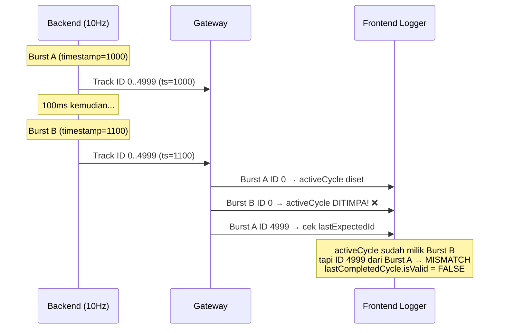
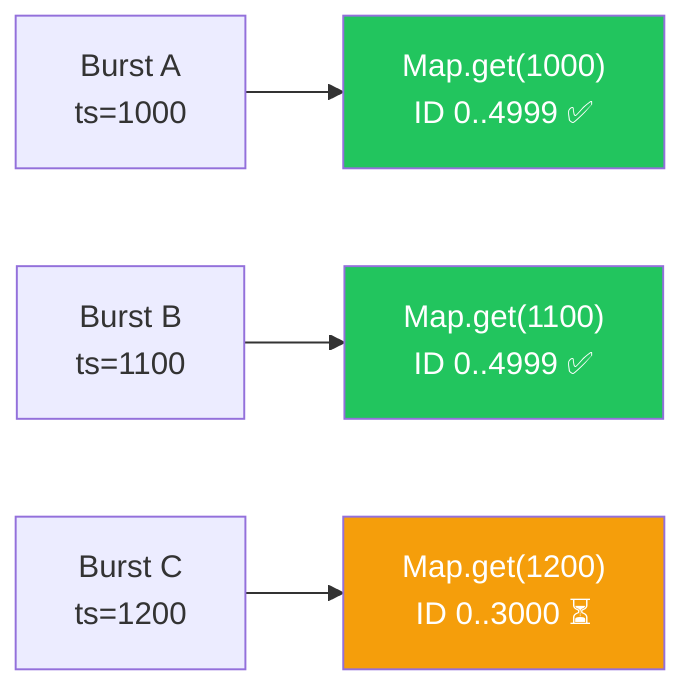

# 🔍 Analisa Fix: RadarLogger Tidak Muncul di Frekuensi Tinggi (10Hz, 50Hz)

**File yang diubah:** [radarLogger.ts](file:///home/chandreu/stream-radar-webdds-v3/fe-webdds/src/utils/logger/radarLogger.ts)  
**Versi:** v5 → v6 (High-Frequency Safe, Time-Based Reporting)  
**Tanggal:** 16 Mei 2026

---

## 📋 Ringkasan Masalah

RadarLogger berfungsi normal pada frekuensi 1Hz, namun **tidak menampilkan laporan performa** ketika frekuensi pengiriman data ditingkatkan ke 10Hz atau 50Hz.

---

## 🔬 Root Cause Analysis

### Masalah 1: Trigger Berbasis Cycle-Count yang Fragile

```
// v5 (LAMA)
const SUMMARY_EVERY_N_CYCLES = 50;

// Trigger di logIncomingPackets():
if (this.stats.cycleCount >= SUMMARY_EVERY_N_CYCLES) {
    this.printSummary(targetCount);
    this.resetStats(performance.now());
}
```

> [!CAUTION]
> Satu "cycle" dihitung ketika `trackId === 0` diterima. Namun pada frekuensi tinggi, **deteksi cycle menjadi tidak reliable** karena burst data saling overlap.

### Masalah 2: State `activeCycle` Ditimpa oleh Burst Berikutnya



**Penjelasan:** Di v5, hanya ada **satu** variabel `activeCycle`. Ketika burst baru datang dan `trackId=0` diterima, `activeCycle` langsung di-overwrite. Jika track terakhir dari burst **sebelumnya** belum sampai, maka `lastCompletedCycle` tidak pernah ter-set sebagai `isValid = true`.

### Masalah 3: Deteksi Cycle Terakhir Terlalu Strict

```typescript
// v5: Hanya valid jika EXACT match
if (track.trackId === lastExpectedId && track.trackId !== 0) {
    this.audit.lastCompletedCycle = { ... isValid: true };
}
```

Kondisi ini **gagal** jika:
- Track terakhir datang sebelum ID 0 (urutan terbalik di WebSocket)
- Ada packet loss sehingga ID terakhir tidak pernah sampai
- Burst baru sudah menimpa `activeCycle`

---

## ✅ Solusi yang Diterapkan (v6)

### Fix 1: Ganti Cycle-Count → Time-Based Reporting (5 detik)

```diff
-const SUMMARY_EVERY_N_CYCLES = 50;
+const REPORT_INTERVAL_MS = 5000;
```

```diff
-// Trigger di logIncomingPackets
-if (this.stats.cycleCount >= SUMMARY_EVERY_N_CYCLES) {
-    this.printSummary(targetCount);
-    this.resetStats(performance.now());
-}
+// Timer independen — SELALU berjalan setiap 5 detik
+private startReportTimer(): void {
+    this.reportTimerId = setInterval(() => {
+        if (this.hasDataInWindow && this.stats.count > 0) {
+            this.printSummary(this.lastKnownTargetCount);
+            stressLogger.triggerSyncReport(...);
+            this.resetStats(performance.now());
+        }
+    }, REPORT_INTERVAL_MS);
+}
```

> [!IMPORTANT]
> Timer dimulai saat data **pertama** diterima dan berjalan independen dari jumlah cycle. Ini menjamin laporan muncul setiap 5 detik **terlepas dari frekuensi Hz**.

### Fix 2: Per-Burst Tracking (Map keyed by timestamp)

```diff
-// v5: Satu variabel yang bisa ditimpa
-private activeCycle = {
-    t0_be_timestamp: 0,
-    t0_gateway_received: 0,
-    t0_fe_received: 0,
-};

+// v6: Map per-burst, keyed by BE timestamp
+private bursts = new Map<number, BurstRecord>();
```



> [!TIP]
> Semua track dalam satu burst dari BE memiliki `timestamp` identik (diset sekali per burst di [app.cpp:101](file:///home/chandreu/stream-radar-webdds-v3/be-stream-odds-cpp/src/app.cpp#L101)). Timestamp ini digunakan sebagai key unik untuk memisahkan burst yang berbeda.

### Fix 3: Deteksi Burst Lengkap yang Lebih Toleran

```diff
-// v5: Harus exact match ID terakhir
-if (track.trackId === lastExpectedId && track.trackId !== 0) {

+// v6: Cukup highestTrackId >= lastExpectedId
+if (burst.hasId0 && burst.highestTrackId >= lastExpectedId && lastExpectedId > 0) {
+    this.lastCompletedBurst = burst;
+}
```

---

## 📊 Perbandingan Sebelum vs Sesudah

| Aspek | v5 (Lama) | v6 (Baru) |
|---|---|---|
| **Trigger Report** | Setiap 50 cycle (`SUMMARY_EVERY_N_CYCLES`) | Setiap 5 detik (`setInterval`) |
| **Burst Tracking** | 1 `activeCycle` (bisa ditimpa) | `Map<timestamp, BurstRecord>` (max 20) |
| **Deteksi Cycle** | `trackId === lastExpectedId` (exact) | `highestTrackId >= lastExpectedId` (toleran) |
| **1Hz** | ✅ Berfungsi (50s per report) | ✅ Berfungsi (5s per report) |
| **10Hz** | ❌ Report tidak muncul | ✅ Berfungsi (5s per report, ~50 bursts) |
| **50Hz** | ❌ Report tidak muncul | ✅ Berfungsi (5s per report, ~250 bursts) |
| **Metrik Akurat** | ✅ (jika muncul) | ✅ Sama persis |

---

## 📈 Metrik yang Ditampilkan (Tidak Berubah)

Semua metrik yang ada di v5 tetap dipertahankan di v6:

1. **Packets** — Total track yang diterima dalam window
2. **Cycles (Bursts)** — Jumlah burst yang diterima *(baru ditampilkan)*
3. **Avg Latency** — Rata-rata latency per-track (GW + WS)
4. **Throughput** — KB/s
5. **ID Verification** — Lengkap atau missing
6. **Transmission → Gateway** — Waktu kirim burst BE → terakhir diterima GW
7. **Transmission → Browser** — Gateway + WS RTT/2
8. **Latensi ID 0** — Latency track pertama
9. **Durasi Streaming** — Selisih waktu terima ID terakhir - ID pertama di FE

---

## 🧪 Cara Verifikasi

1. Jalankan sistem dengan konfigurasi **1Hz** → pastikan laporan muncul setiap ~5 detik
2. Ubah ke **10Hz** (BE sleep 100ms) → pastikan laporan tetap muncul setiap ~5 detik
3. Ubah ke **50Hz** (BE sleep 20ms) → pastikan laporan tetap muncul setiap ~5 detik
4. Periksa bahwa field `Cycles (Bursts)` menunjukkan jumlah burst yang sesuai:
   - 1Hz × 5s = ~5 bursts
   - 10Hz × 5s = ~50 bursts
   - 50Hz × 5s = ~250 bursts

> [!NOTE]
> Untuk mengubah frekuensi Hz, ubah `sleep_for` di [app.cpp:98](file:///home/chandreu/stream-radar-webdds-v3/be-stream-odds-cpp/src/app.cpp#L98):
> - 1Hz = `sleep_for(1000ms)`
> - 10Hz = `sleep_for(100ms)` ← saat ini
> - 50Hz = `sleep_for(20ms)`

---

## 📁 Diff Lengkap

```diff:radarLogger.ts
/**
 * @file radarLogger.ts (v5 — Table-Accurate Metrics)
 * @description Auditor performa Web DDS Radar.
 *
 * v5 Changes (sesuai definisi tabel pengujian):
 *   1. Transmission → Gateway = first track sent → LAST track received at Gateway.
 *      Formula: tLast_gateway_received - t0_be_timestamp (same WSL clock, akurat).
 *   2. Transmission → Browser = txToGateway + RTT/2 (total first sent → last received Browser).
 *      → Browser SELALU >= Gateway karena data melewati gateway dulu.
 *   3. Avg Latency = rata-rata per-track (gatewayReceivedAt - timestamp) + RTT/2.
 *      = average latency setiap track dari BE sampai Browser.
 *   4. Durasi streaming = selisih waktu terima ID terakhir - ID pertama di FE (same-clock).
 */

import { TrackData } from '../../types/RadarTrack';
import { commandLogger } from './commandLogger';
import { driftManager } from './driftManager';
import { formatLoggerTime } from '../formatters';
import { integrityManager } from './integrityManager';
import { LOGGER_STYLES, getTimeHeader } from '../colors';
import { stressLogger } from './stressLogger';

// Cetak summary setiap N siklus
const SUMMARY_EVERY_N_CYCLES = 50;

class RadarLogger {
  private enabled: boolean = true;

  /**
   * Audit data dari siklus terakhir yang lengkap (ID 0 s/d ID terakhir sudah diterima).
   * Semua timestamp disimpan mentah — konversi dilakukan saat print.
   */
  private audit = {
    t_be_command_received: 0,
    lastCompletedCycle: {
      t0_be_timestamp: 0,        // timestamp burst dari BE (WSL clock)
      t0_gateway_received: 0,    // gateway Date.now() saat terima ID 0 (WSL clock)
      t0_fe_received: 0,         // FE arrival saat terima ID 0 (Windows clock)
      tLast_gateway_received: 0, // gateway Date.now() saat terima ID terakhir
      tLast_fe_received: 0,      // FE arrival saat terima ID terakhir
      isValid: false
    }
  };

  private activeCycle = {
    t0_be_timestamp: 0,
    t0_gateway_received: 0,
    t0_fe_received: 0,
  };

  private stats = {
    count: 0,
    totalBytes: 0,
    totalLatGateway: 0,   // akumulasi latency BE→Gateway (akurat, same clock)
    cycleCount: 0,
    startTime: performance.now(),
    lastIntegritySnapshot: {
      receivedCount: 0,
      targetCount: 0,
      timestamp: 0,
      missingIds: [] as number[],
      isComplete: true
    }
  };

  private receivedIds = new Set<number>();

  public logIncomingPackets(
    data: unknown,
    tracks: TrackData[],
    targetCount: number,
    rawLength?: number
  ): void {
    this.stats.count += tracks.length;
    const byteSize = rawLength ?? (tracks.length * 150);
    this.stats.totalBytes += byteSize;

    const arrivalTime = driftManager.now();

    tracks.forEach(track => {
      // Latency BE→Gateway (same WSL clock — akurat)
      const latGateway = Math.max(0, track.gatewayReceivedAt - track.timestamp);
      this.stats.totalLatGateway += latGateway;

      this.receivedIds.add(track.trackId);

      if (track.trackId === 0) {
        this.activeCycle.t0_be_timestamp = track.timestamp;
        this.activeCycle.t0_gateway_received = track.gatewayReceivedAt;
        this.activeCycle.t0_fe_received = arrivalTime;
        this.audit.t_be_command_received = track.commandReceivedAt;
        this.stats.cycleCount++;

        // Pass both timestamps to commandLogger
        commandLogger.logCommandArrival(track.commandReceivedAt, track.timestamp);
      }

      const lastExpectedId = targetCount - 1;
      if (track.trackId === lastExpectedId && track.trackId !== 0) {
        this.audit.lastCompletedCycle = {
          t0_be_timestamp: this.activeCycle.t0_be_timestamp,
          t0_gateway_received: this.activeCycle.t0_gateway_received,
          t0_fe_received: this.activeCycle.t0_fe_received,
          tLast_gateway_received: track.gatewayReceivedAt,
          tLast_fe_received: arrivalTime,
          isValid: true
        };
      }
    });

    // Cetak per N siklus
    if (this.stats.cycleCount >= SUMMARY_EVERY_N_CYCLES) {
      // 1. Hitung integritas & Ambil snapshot
      this.printSummary(targetCount);
      
      // 2. Trigger laporan MultiTopic dengan timestamp yang baru saja selesai diaudit
      stressLogger.triggerSyncReport(this.stats.lastIntegritySnapshot.timestamp);
      
      this.resetStats(performance.now());
    }
  }

  public logFeToBeSend(targetCount: number): void {
    commandLogger.logCommandSend(targetCount);
  }

  /**
   * Print summary sesuai format standar pengujian.
   *
   * Format:
   *   Radar Periodic Report (HH:MM:SS)
   *   =========================
   *   [ Be > gateway > FE ]
   *   =========================
   *   Packets          : N
   *   Avg Latency      : X.XXms  (GW X.XXms + WS X.XXms)   ← per-track avg to Browser
   *   Throughput       : X.XX KB/s
   *   -------------------------------------------
   *   Total Track Diterima : N
   *   ID Verification      : LENGKAP / N MISSING
   *   -------------------------------------------
   *   Transmission → Gateway : X.XXms  (first sent → last received at GW)
   *   Transmission → Browser : X.XXms  (Gateway + WS RTT/2)
   *   -------------------------------------------
   *   Waktu Kirim ID 0   : HH:MM:SS.mmm
   *   Waktu Terima ID 0  : HH:MM:SS.mmm
   *   Latensi ID 0       : X.XXms
   *   -------------------------------------------
   *   Waktu Terima ID N  : HH:MM:SS.mmm
   *   Durasi streaming   : X.XXms
   *   -------------------------------------------
   */
  private printSummary(targetCount: number): void {
    if (!this.enabled) return;

    // 1. Hitung integritas
    const missingIds: number[] = [];
    for (let i = 0; i < targetCount; i++) {
      if (!this.receivedIds.has(i)) missingIds.push(i);
    }
    const isComplete = missingIds.length === 0;

    const cycle = this.audit.lastCompletedCycle;
    
    // 2. Simpan Snapshot untuk logger lain (sebelum reset)
    this.stats.lastIntegritySnapshot = {
      receivedCount: this.receivedIds.size,
      targetCount: targetCount,
      timestamp: cycle.t0_be_timestamp,
      missingIds: [...missingIds],
      isComplete: isComplete
    };

    const duration = (performance.now() - this.stats.startTime) / 1000;
    const throughput = (this.stats.totalBytes / 1024) / duration;

    // Gateway→Browser segment
    const gwToBrowser = driftManager.getRtt();

    const avgLatGateway = this.stats.count > 0
      ? (this.stats.totalLatGateway / this.stats.count)
      : 0;
    const avgLatency = avgLatGateway + gwToBrowser;

    const txToGateway = cycle.isValid ? Math.max(0, cycle.tLast_gateway_received - cycle.t0_be_timestamp) : 0;
    const txToBrowser = txToGateway + gwToBrowser;
    const latId0_gateway = cycle.isValid ? (cycle.t0_gateway_received - cycle.t0_be_timestamp) : 0;
    const streamingDuration = cycle.isValid ? Math.max(0, cycle.tLast_fe_received - cycle.t0_fe_received) : 0;

    // ====================== PRINT ======================
    console.groupCollapsed(
      `%c Radar Periodic Report (${getTimeHeader()})`,
      LOGGER_STYLES.header
    );

    console.log(`%c=========================`, LOGGER_STYLES.separator);
    console.log(`%c[ Be > gateway > FE ]`, LOGGER_STYLES.section);
    console.log(`%c=========================`, LOGGER_STYLES.separator);

    console.log(`%cPackets          : %c${this.stats.count}`, LOGGER_STYLES.label, LOGGER_STYLES.value);
    console.log(`%cAvg Latency      : %c${avgLatency.toFixed(2)}ms  (GW ${avgLatGateway.toFixed(2)}ms + WS ${gwToBrowser.toFixed(2)}ms)`, LOGGER_STYLES.label, LOGGER_STYLES.value);
    console.log(`%cThroughput       : %c${throughput.toFixed(2)} KB/s`, LOGGER_STYLES.label, LOGGER_STYLES.value);

    console.log(`%c${LOGGER_STYLES.sepLine}`, LOGGER_STYLES.separator);

    console.log(`%cTotal Track Diterima (per siklus): %c${this.receivedIds.size}`, LOGGER_STYLES.label, LOGGER_STYLES.value);

    console.groupCollapsed(`%cID Verification   : %c${isComplete ? 'LENGKAP' : missingIds.length + ' MISSING'}`, LOGGER_STYLES.label, isComplete ? LOGGER_STYLES.value : 'color: #ef4444');
    
    const idsArray = Array.from(this.receivedIds).sort((a, b) => a - b);
    
    if (!isComplete) {
      console.log(`%cMissing IDs: %c${missingIds.join(', ')}`, 'color: #fca5a5', 'color: #ef4444; font-family: monospace');
    } else {
      console.log('%cSemua ID (0 s/d ' + (targetCount - 1) + ') diterima tanpa celah.', 'color: #34d399');
    }

    console.log('%cFull Received ID List:', 'color: #9ca3af', idsArray);
    console.groupEnd();

    console.log(`%c${LOGGER_STYLES.sepLine}`, LOGGER_STYLES.separator);

    if (cycle.isValid) {
      const lastId = targetCount - 1;

      console.log(
        `%cTransmission → Gateway : %c${txToGateway.toFixed(2)}ms  (ID 0 sent → ID ${lastId} received at GW)`,
        LOGGER_STYLES.label, LOGGER_STYLES.duration
      );
      console.log(
        `%cTransmission → Browser : %c${txToBrowser.toFixed(2)}ms  (Gateway ${txToGateway.toFixed(2)}ms + WS ${gwToBrowser.toFixed(2)}ms)`,
        LOGGER_STYLES.label, LOGGER_STYLES.duration
      );

      console.log(`%c${LOGGER_STYLES.sepLine}`, LOGGER_STYLES.separator);

      // Waktu kirim = BE burst timestamp (WSL clock)
      // Untuk display, kita tampilkan apa adanya — biarkan user tahu ini waktu BE
      console.log(
        `%cWaktu Kirim ID 0   : %c${formatLoggerTime(cycle.t0_be_timestamp)}`,
        LOGGER_STYLES.label, LOGGER_STYLES.value
      );
      console.log(
        `%cWaktu Terima ID 0  : %c${formatLoggerTime(cycle.t0_gateway_received)}`,
        LOGGER_STYLES.label, LOGGER_STYLES.value
      );
      console.log(
        `%cLatensi ID 0 : %c${latId0_gateway.toFixed(2)}ms`,
        LOGGER_STYLES.label,
        latId0_gateway >= 0 && latId0_gateway < 500 ? LOGGER_STYLES.value : 'color: #ef4444'
      );

      console.log(`%c${LOGGER_STYLES.sepLine}`, LOGGER_STYLES.separator);

      console.log(
        `%cWaktu Terima ID ${lastId} : %c${formatLoggerTime(cycle.tLast_gateway_received)}`,
        LOGGER_STYLES.label, LOGGER_STYLES.value
      );
      console.log(
        `%cDurasi streaming (id awal kirim di be -> id akhir diterima fe) : %c${streamingDuration.toFixed(2)}ms`,
        LOGGER_STYLES.label, LOGGER_STYLES.duration
      );

      console.log(`%c${LOGGER_STYLES.sepLine}`, LOGGER_STYLES.separator);
    } else {
      console.log(
        '%c[!] Siklus belum lengkap untuk audit presisi.',
        'color: #f59e0b'
      );
    }

    console.groupEnd();
  }

  private resetStats(now: number): void {
    this.stats.count = 0;
    this.stats.totalBytes = 0;
    this.stats.totalLatGateway = 0;
    this.stats.cycleCount = 0;
    this.stats.startTime = now;
    this.receivedIds.clear();
  }

  public logDataDrop(currentCount: number, targetCount: number): void {
    integrityManager.logDataDrop(currentCount, targetCount);
  }

  public logError(ctx: string, err: any) {
    console.error(`[Error] ${ctx}:`, err);
  }

  public logConnection(status: string, url: string) {
    if (!this.enabled) return;
    console.log(`[Connection] ${status}: ${url}`);
  }

  public getIntegrityStatus() {
    const missingIds: number[] = [];
    const tCount = this.stats.cycleCount > 0 ? (this.audit.lastCompletedCycle.isValid ? (this.receivedIds.size + (this.audit.lastCompletedCycle.isValid ? 0 : 0)) : 0) : 0; 
    return {
      receivedIds: new Set(this.receivedIds),
      targetCount: this.stats.count > 0 ? (this.audit.lastCompletedCycle.isValid ? (this.receivedIds.size + missingIds.length) : 0) : 0
    };
  }

  /**
   * Mengambil data kelengkapan ID terbaru (Snapshot Terakhir)
   * untuk digunakan oleh stressLogger agar sinkron.
   */
  public getLatestIntegrity() {
    return this.stats.lastIntegritySnapshot;
  }
}

export const radarLogger = new RadarLogger();
===
/**
 * @file radarLogger.ts (v6 — High-Frequency Safe, Time-Based Reporting)
 * @description Auditor performa Web DDS Radar.
 *
 * v6 Changes (fix untuk 10Hz, 50Hz, dll):
 *   - GANTI trigger dari cycle-count (SUMMARY_EVERY_N_CYCLES) ke TIME-BASED (5 detik).
 *     Alasan: di frekuensi tinggi, siklus sangat cepat dan cycle-detection bisa gagal
 *     karena track dari burst baru datang sebelum burst sebelumnya selesai diterima.
 *   - Track per-burst menggunakan timestamp sebagai key, bukan hanya satu activeCycle
 *     yang bisa ditimpa. Ini memastikan burst yang overlap tidak saling menghapus data.
 *   - Metrics tetap sama: Transmission → Gateway, Transmission → Browser, Avg Latency,
 *     Throughput, ID Verification, Durasi Streaming.
 */

import { TrackData } from '../../types/RadarTrack';
import { commandLogger } from './commandLogger';
import { driftManager } from './driftManager';
import { formatLoggerTime } from '../formatters';
import { integrityManager } from './integrityManager';
import { LOGGER_STYLES, getTimeHeader } from '../colors';
import { stressLogger } from './stressLogger';

/** Interval laporan periodik dalam milidetik */
const REPORT_INTERVAL_MS = 5000;

/** Data satu burst (satu siklus pengiriman dari BE) */
interface BurstRecord {
  t0_be_timestamp: number;       // timestamp burst dari BE (WSL clock)
  t0_gateway_received: number;   // gateway Date.now() saat terima ID 0
  t0_fe_received: number;        // FE arrival saat terima ID 0
  tLast_gateway_received: number; // gateway Date.now() saat terima ID terakhir
  tLast_fe_received: number;     // FE arrival saat terima ID terakhir
  highestTrackId: number;        // ID track tertinggi yang diterima di burst ini
  receivedIds: Set<number>;      // Set ID yang diterima di burst ini
  hasId0: boolean;               // Apakah ID 0 sudah diterima
}

class RadarLogger {
  private enabled: boolean = true;

  /**
   * Per-burst tracking: key = BE timestamp (semua track dalam satu burst
   * memiliki timestamp identik dari BE).
   */
  private bursts = new Map<number, BurstRecord>();

  /** Burst terakhir yang terselesaikan (ID 0 + ID terakhir keduanya diterima) */
  private lastCompletedBurst: BurstRecord | null = null;

  private audit = {
    t_be_command_received: 0,
  };

  private stats = {
    count: 0,
    totalBytes: 0,
    totalLatGateway: 0,   // akumulasi latency BE→Gateway (akurat, same clock)
    cycleCount: 0,        // jumlah burst (setiap kali ID 0 diterima)
    startTime: performance.now(),
    lastIntegritySnapshot: {
      receivedCount: 0,
      targetCount: 0,
      timestamp: 0,
      missingIds: [] as number[],
      isComplete: true
    }
  };

  /** Set ID yang diterima dalam window pelaporan ini (untuk integrity check) */
  private receivedIds = new Set<number>();

  /** Timer ID untuk periodic report */
  private reportTimerId: ReturnType<typeof setInterval> | null = null;

  /** targetCount terakhir yang diketahui (untuk integrity check di timer) */
  private lastKnownTargetCount: number = 0;

  /** Flag: apakah sudah pernah menerima data dalam window ini */
  private hasDataInWindow: boolean = false;

  public logIncomingPackets(
    data: unknown,
    tracks: TrackData[],
    targetCount: number,
    rawLength?: number
  ): void {
    this.stats.count += tracks.length;
    const byteSize = rawLength ?? (tracks.length * 150);
    this.stats.totalBytes += byteSize;
    this.lastKnownTargetCount = targetCount;
    this.hasDataInWindow = true;

    const arrivalTime = driftManager.now();

    // Start timer pada data pertama yang diterima
    if (this.reportTimerId === null) {
      this.startReportTimer();
    }

    tracks.forEach(track => {
      // Latency BE→Gateway (same WSL clock — akurat)
      // gatewayReceivedAt di-inject oleh gateway, tidak ada di IDL type
      const gwReceivedAt: number = (track as any).gatewayReceivedAt || 0;
      const latGateway = Math.max(0, gwReceivedAt - track.timestamp);
      this.stats.totalLatGateway += latGateway;

      this.receivedIds.add(track.trackId);

      // --- Per-burst tracking ---
      const burstKey = track.timestamp;
      let burst = this.bursts.get(burstKey);

      if (!burst) {
        burst = {
          t0_be_timestamp: burstKey,
          t0_gateway_received: 0,
          t0_fe_received: 0,
          tLast_gateway_received: 0,
          tLast_fe_received: 0,
          highestTrackId: -1,
          receivedIds: new Set<number>(),
          hasId0: false,
        };
        this.bursts.set(burstKey, burst);

        // Bersihkan burst lama (simpan max 20 burst terbaru)
        if (this.bursts.size > 20) {
          const oldestKey = this.bursts.keys().next().value;
          if (oldestKey !== undefined) this.bursts.delete(oldestKey);
        }
      }

      burst.receivedIds.add(track.trackId);

      // Track ID 0: catat waktu awal burst
      if (track.trackId === 0) {
        burst.hasId0 = true;
        burst.t0_be_timestamp = track.timestamp;
        burst.t0_gateway_received = gwReceivedAt;
        burst.t0_fe_received = arrivalTime;
        this.audit.t_be_command_received = track.commandReceivedAt;
        this.stats.cycleCount++;

        // Pass both timestamps to commandLogger
        commandLogger.logCommandArrival(track.commandReceivedAt, track.timestamp);
      }

      // Update highest received track dan waktu terima terakhir
      if (track.trackId > burst.highestTrackId) {
        burst.highestTrackId = track.trackId;
        burst.tLast_gateway_received = gwReceivedAt;
        burst.tLast_fe_received = arrivalTime;
      }

      // Cek apakah burst sudah lengkap
      const lastExpectedId = targetCount - 1;
      if (burst.hasId0 && burst.highestTrackId >= lastExpectedId && lastExpectedId > 0) {
        this.lastCompletedBurst = burst;
      }
    });
  }

  public logFeToBeSend(targetCount: number): void {
    commandLogger.logCommandSend(targetCount);
  }

  /**
   * Start timer periodik untuk cetak laporan setiap REPORT_INTERVAL_MS.
   */
  private startReportTimer(): void {
    if (this.reportTimerId !== null) return;

    this.reportTimerId = setInterval(() => {
      if (this.hasDataInWindow && this.stats.count > 0) {
        this.printSummary(this.lastKnownTargetCount);

        // Trigger laporan MultiTopic
        stressLogger.triggerSyncReport(this.stats.lastIntegritySnapshot.timestamp);

        this.resetStats(performance.now());
      }
    }, REPORT_INTERVAL_MS);
  }

  /**
   * Print summary sesuai format standar pengujian.
   *
   * Format:
   *   Radar Periodic Report (HH:MM:SS)
   *   =========================
   *   [ Be > gateway > FE ]
   *   =========================
   *   Packets          : N
   *   Cycles (Bursts)  : N
   *   Avg Latency      : X.XXms  (GW X.XXms + WS X.XXms)
   *   Throughput       : X.XX KB/s
   *   -------------------------------------------
   *   Total Track Diterima : N
   *   ID Verification      : LENGKAP / N MISSING
   *   -------------------------------------------
   *   Transmission → Gateway : X.XXms
   *   Transmission → Browser : X.XXms
   *   -------------------------------------------
   *   Waktu Kirim ID 0   : HH:MM:SS.mmm
   *   Waktu Terima ID 0  : HH:MM:SS.mmm
   *   Latensi ID 0       : X.XXms
   *   -------------------------------------------
   *   Waktu Terima ID N  : HH:MM:SS.mmm
   *   Durasi streaming   : X.XXms
   *   -------------------------------------------
   */
  private printSummary(targetCount: number): void {
    if (!this.enabled) return;

    // 1. Hitung integritas (dari receivedIds window ini)
    const missingIds: number[] = [];
    for (let i = 0; i < targetCount; i++) {
      if (!this.receivedIds.has(i)) missingIds.push(i);
    }
    const isComplete = missingIds.length === 0;

    // Gunakan burst terlengkap yang tersedia
    const cycle = this.lastCompletedBurst;
    const hasCycle = cycle !== null && cycle.hasId0;

    // 2. Simpan Snapshot untuk logger lain (sebelum reset)
    this.stats.lastIntegritySnapshot = {
      receivedCount: this.receivedIds.size,
      targetCount: targetCount,
      timestamp: hasCycle ? cycle!.t0_be_timestamp : 0,
      missingIds: [...missingIds],
      isComplete: isComplete
    };

    const duration = (performance.now() - this.stats.startTime) / 1000;
    const throughput = (this.stats.totalBytes / 1024) / duration;

    // Gateway→Browser segment
    const gwToBrowser = driftManager.getRtt();

    const avgLatGateway = this.stats.count > 0
      ? (this.stats.totalLatGateway / this.stats.count)
      : 0;
    const avgLatency = avgLatGateway + gwToBrowser;

    const txToGateway = hasCycle ? Math.max(0, cycle!.tLast_gateway_received - cycle!.t0_be_timestamp) : 0;
    const txToBrowser = txToGateway + gwToBrowser;
    const latId0_gateway = hasCycle ? (cycle!.t0_gateway_received - cycle!.t0_be_timestamp) : 0;
    const streamingDuration = hasCycle ? Math.max(0, cycle!.tLast_fe_received - cycle!.t0_fe_received) : 0;

    // ====================== PRINT ======================
    console.groupCollapsed(
      `%c Radar Periodic Report (${getTimeHeader()})`,
      LOGGER_STYLES.header
    );

    console.log(`%c=========================`, LOGGER_STYLES.separator);
    console.log(`%c[ Be > gateway > FE ]`, LOGGER_STYLES.section);
    console.log(`%c=========================`, LOGGER_STYLES.separator);

    console.log(`%cPackets          : %c${this.stats.count}`, LOGGER_STYLES.label, LOGGER_STYLES.value);
    console.log(`%cCycles (Bursts)  : %c${this.stats.cycleCount}`, LOGGER_STYLES.label, LOGGER_STYLES.value);
    console.log(`%cAvg Latency      : %c${avgLatency.toFixed(2)}ms  (GW ${avgLatGateway.toFixed(2)}ms + WS ${gwToBrowser.toFixed(2)}ms)`, LOGGER_STYLES.label, LOGGER_STYLES.value);
    console.log(`%cThroughput       : %c${throughput.toFixed(2)} KB/s`, LOGGER_STYLES.label, LOGGER_STYLES.value);

    console.log(`%c${LOGGER_STYLES.sepLine}`, LOGGER_STYLES.separator);

    console.log(`%cTotal Track Diterima (per window): %c${this.receivedIds.size}`, LOGGER_STYLES.label, LOGGER_STYLES.value);

    console.groupCollapsed(`%cID Verification   : %c${isComplete ? 'LENGKAP' : missingIds.length + ' MISSING'}`, LOGGER_STYLES.label, isComplete ? LOGGER_STYLES.value : 'color: #ef4444');
    
    const idsArray = Array.from(this.receivedIds).sort((a, b) => a - b);
    
    if (!isComplete) {
      console.log(`%cMissing IDs: %c${missingIds.join(', ')}`, 'color: #fca5a5', 'color: #ef4444; font-family: monospace');
    } else {
      console.log('%cSemua ID (0 s/d ' + (targetCount - 1) + ') diterima tanpa celah.', 'color: #34d399');
    }

    console.log('%cFull Received ID List:', 'color: #9ca3af', idsArray);
    console.groupEnd();

    console.log(`%c${LOGGER_STYLES.sepLine}`, LOGGER_STYLES.separator);

    if (hasCycle) {
      const lastId = cycle!.highestTrackId;

      console.log(
        `%cTransmission → Gateway : %c${txToGateway.toFixed(2)}ms  (ID 0 sent → ID ${lastId} received at GW)`,
        LOGGER_STYLES.label, LOGGER_STYLES.duration
      );
      console.log(
        `%cTransmission → Browser : %c${txToBrowser.toFixed(2)}ms  (Gateway ${txToGateway.toFixed(2)}ms + WS ${gwToBrowser.toFixed(2)}ms)`,
        LOGGER_STYLES.label, LOGGER_STYLES.duration
      );

      console.log(`%c${LOGGER_STYLES.sepLine}`, LOGGER_STYLES.separator);

      // Waktu kirim = BE burst timestamp (WSL clock)
      console.log(
        `%cWaktu Kirim ID 0   : %c${formatLoggerTime(cycle!.t0_be_timestamp)}`,
        LOGGER_STYLES.label, LOGGER_STYLES.value
      );
      console.log(
        `%cWaktu Terima ID 0  : %c${formatLoggerTime(cycle!.t0_gateway_received)}`,
        LOGGER_STYLES.label, LOGGER_STYLES.value
      );
      console.log(
        `%cLatensi ID 0 : %c${latId0_gateway.toFixed(2)}ms`,
        LOGGER_STYLES.label,
        latId0_gateway >= 0 && latId0_gateway < 500 ? LOGGER_STYLES.value : 'color: #ef4444'
      );

      console.log(`%c${LOGGER_STYLES.sepLine}`, LOGGER_STYLES.separator);

      console.log(
        `%cWaktu Terima ID ${lastId} : %c${formatLoggerTime(cycle!.tLast_gateway_received)}`,
        LOGGER_STYLES.label, LOGGER_STYLES.value
      );
      console.log(
        `%cDurasi streaming (id awal kirim di be -> id akhir diterima fe) : %c${streamingDuration.toFixed(2)}ms`,
        LOGGER_STYLES.label, LOGGER_STYLES.duration
      );

      console.log(`%c${LOGGER_STYLES.sepLine}`, LOGGER_STYLES.separator);
    } else {
      console.log(
        '%c[!] Belum ada burst lengkap (ID 0 + ID terakhir) untuk audit presisi.',
        'color: #f59e0b'
      );
    }

    console.groupEnd();
  }

  private resetStats(now: number): void {
    this.stats.count = 0;
    this.stats.totalBytes = 0;
    this.stats.totalLatGateway = 0;
    this.stats.cycleCount = 0;
    this.stats.startTime = now;
    this.receivedIds.clear();
    this.hasDataInWindow = false;
    this.lastCompletedBurst = null;

    // Bersihkan semua burst data dari window sebelumnya
    this.bursts.clear();
  }

  public logDataDrop(currentCount: number, targetCount: number): void {
    integrityManager.logDataDrop(currentCount, targetCount);
  }

  public logError(ctx: string, err: any) {
    console.error(`[Error] ${ctx}:`, err);
  }

  public logConnection(status: string, url: string) {
    if (!this.enabled) return;
    console.log(`[Connection] ${status}: ${url}`);
  }

  public getIntegrityStatus() {
    const missingIds: number[] = [];
    const tCount = this.stats.cycleCount > 0 ? (this.lastCompletedBurst !== null ? (this.receivedIds.size + (this.lastCompletedBurst !== null ? 0 : 0)) : 0) : 0; 
    return {
      receivedIds: new Set(this.receivedIds),
      targetCount: this.stats.count > 0 ? (this.lastCompletedBurst !== null ? (this.receivedIds.size + missingIds.length) : 0) : 0
    };
  }

  /**
   * Mengambil data kelengkapan ID terbaru (Snapshot Terakhir)
   * untuk digunakan oleh stressLogger agar sinkron.
   */
  public getLatestIntegrity() {
    return this.stats.lastIntegritySnapshot;
  }
}

export const radarLogger = new RadarLogger();
```
